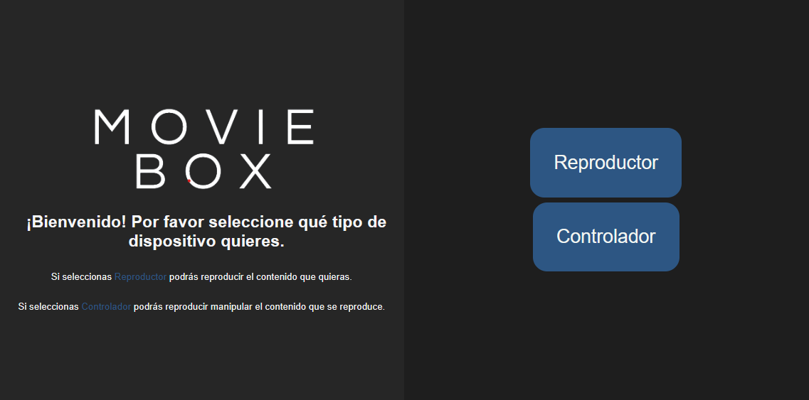
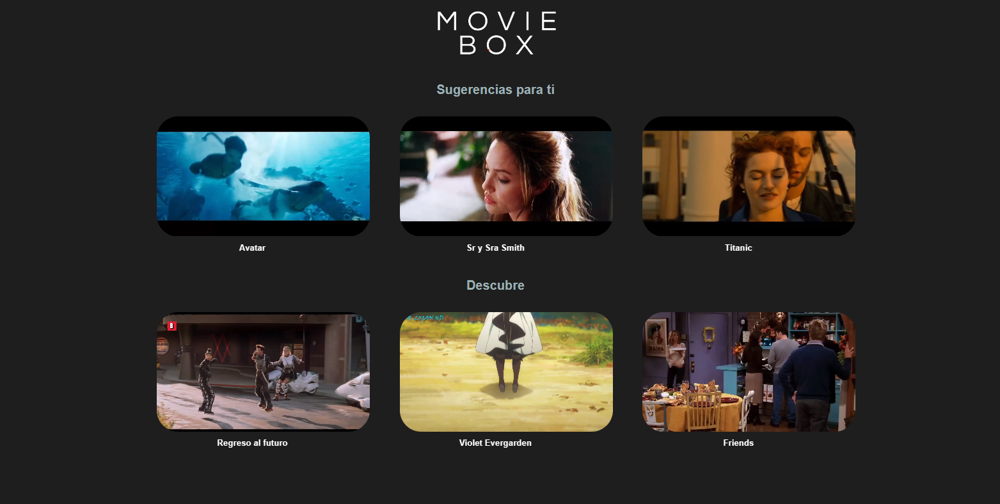
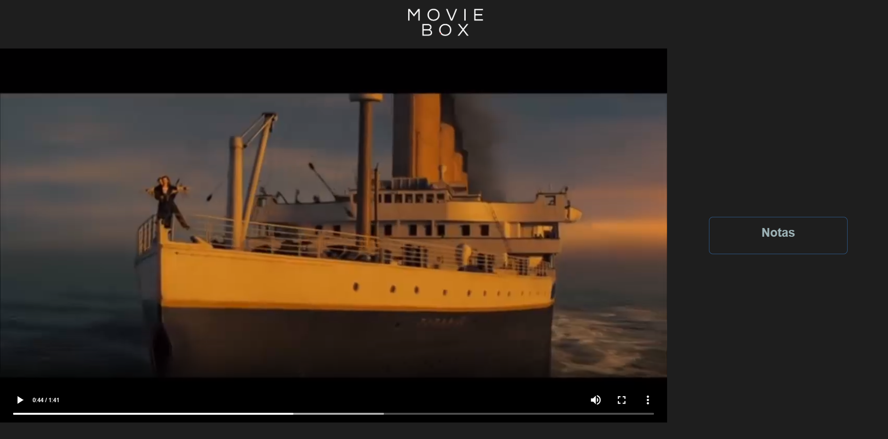
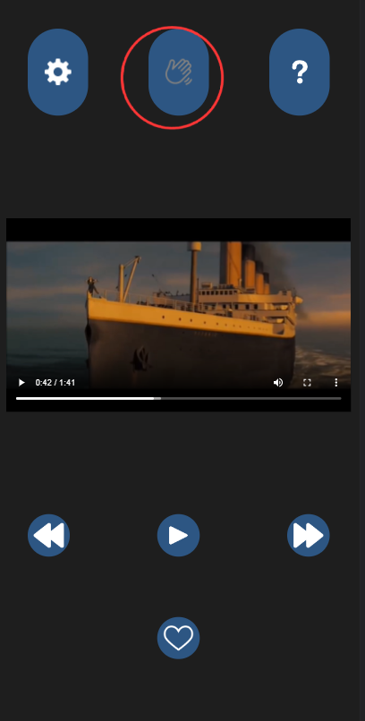
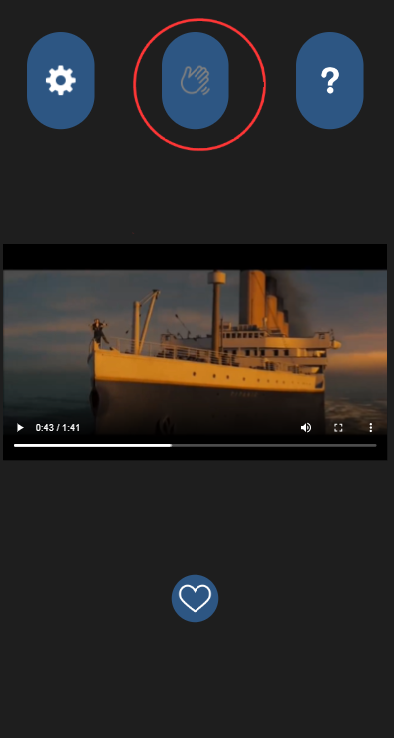
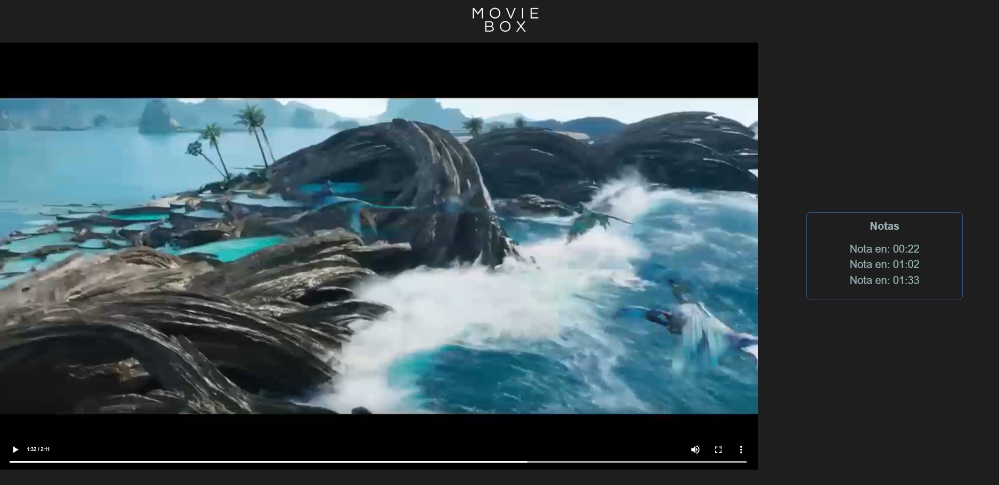
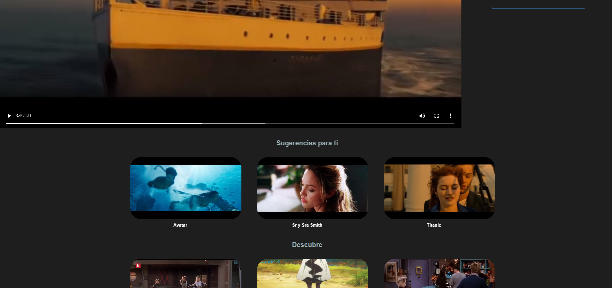

### Ruth Navarro Carrasco, Alicia Benítez Rogero y Ángel José Mancha Núñez

# Magic Box

Este proyecto consiste en una aplicación de reproducción de videos que se puede controlar mediante gestos con el móvil. Está especialmente diseñada para ser utilizada en un ambiente educativo, en donde el profesor utilizará la parte controladora de la app desde su dispositivo móvil para interactuar con el video que se estará mostrando en otro dispositivo, como un proyector.

### Funcionalidades principales
La aplicación estará dividida en dos partes: una parte controladora que se ejecutará en el dispositivo móvil del profesor, y una parte visualizadora que se alojará en otro dispositivo para poder ver el contenido. Las funcionalidades principales de la aplicación son las siguientes:

### Control mediante gestos
La aplicación permitirá controlar el video mediante gestos realizados en la pantalla del dispositivo móvil del profesor. De esta forma, el profesor podrá interactuar con el video desde cualquier punto de la clase, lo que proporcionará un dinamismo adicional a las clases.

### Anotaciones en tiempo real
Además de la funcionalidad de control mediante gestos, la aplicación también permitirá al profesor realizar anotaciones en tiempo real sobre el video realizando un simple gesto con el controlador. Estas anotaciones se guardarán en el minuto y segundo exacto en el que se realizaron, en la pantalla del visualizador, lo que facilitará la revisión de las dudas y preguntas que surjan durante la clase.

### Modo táctil
Para mayor comodidad del profesor, también se ha incluido un botón para desactivar el reconocimiento de gestos y pasar al modo táctil para controlar el video. Esta función evitará que el profesor tenga que estar pendiente de los gestos involuntarios mientras realiza otra tarea con el móvil.

## Uso de la aplicación
**1.** Ir a la carpeta raiz y lanzar el servidor

```bash
  cd src
  node idnex.js
```
**2.** Conectarse a *localhost 3000*

**3.** Seleccionar adecuadamente cómo queremos que actúe el dispositivo actual (controlador o visualizador)



**4.** En el visualizador, seleccionar un video.



**5**.  Una vez se haya seleccionado el video, el controlador mostrará una miniatura de ese mismo video.
    Por defecto, el controlador está en modo táctil para controlar el video, por lo que presionamos el botón indicado para pasar al modo gestos.

 
Se puede observar cómo a la derecha aparece un apartado en el que aparecerán anotaciones.

 

**6.** Dentro del modo gestos:
- Para 'reproducir/pausar' el video: Según está colgado del cuello, **inclinar el móvil hacia arriba** y volverlo a dejar caer.
- Para 'adelantar' el video: **Agitar hacia la derecha** el móvil.
- Para 'retrasar' el video: **Agitar hacia la izquierda** el móvil.


**7.** Para volver al modo táctil bastará con volver a presionar el botón indicado y los gestos se desactivarán.



**8.** Para tomar anotaciones de las dudas de los alumnos en el minuto y segundo exacto: **Deslizar con 3 dedos** sobre la pantalla del controlador hacia abajo.



**9.** Para cambiar de video, basta con deslizar la ventana del visualizador hacia abajo y seleccionar otro video. Este se actualizará en el controlador.




## Tecnologías usadas
La aplicación se ha desarrollado utilizando las siguientes tecnologías:

- Lenguaje de programación: JavaScript, HTML, CSS
- Entorno de tiempo de ejecución: Node.js
- Framework para el reconocimiento de gestos: AbsoluteOrientationSensor
